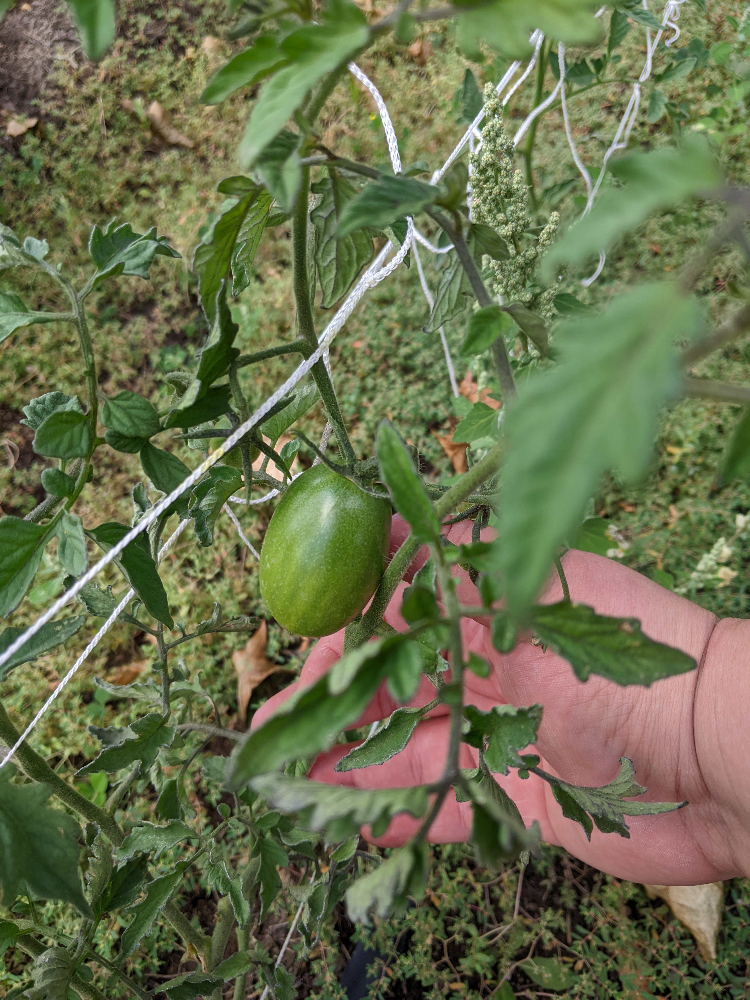

```{r setup, include=FALSE}
knitr::opts_chunk$set(echo = TRUE)
```

# Introduction

In this repository we will be interviewing a Learning Language Model (LLM), ChatGPT, on how to become the best tomato gardener in the Western Rockies. We will be testing its limits on knowledge of tomato growing best practice, testing its admission of potential inaccuracies and errors, questioning its confidence and then discussing how to strategically spot errors in the future. 

*A little bit of background information about me and my connection to tomato gardening;* I have been growing tomatoes on and off for a few years now in warmer climates, but now reside in Montana which presents a challenge. I know that this climate holds shorter growing seasons that have less frequently hot days through the summer months than other climates I am accustomed to. However, I have now grown tomatoes in Montana for 3 seasons, so I am well into my understanding of how to grow them properly and what the necessary steps involve. While I am not an expert, I would rank my experience as intermediate when it comes to growing tomatoes and feel educated enough to spot minor to medium-level discrepancies in my knowledge, the help of some seed packets during the testing phase and the information that ChatGPT might educate me. 


## Fine Tuning and Identifying Inaccuracies

The interview with ChatGPT begins with my interest in wanting to learn how to grow the best tomatoes without any help and asking the LLM to teach me about them. In this first round of interview dialog, its responses were not as thorough and did not include information about gardening zones. The LLM also did not include any historical information about tomatoes, or much about the harvesting and preservation processes. Most of the information provided was quite basic so I worked on fine tuning its responses by asking further detailed questions to narrow down the scope of the LLMs responses. 

I decided to focus on the area so inquired about the importance of growing zones and the different varieties that might be best to grow in areas near Missoula, Montana. When given this further prompting, ChatGPT included the correct hardiness zone for my area, which was accurate. From here I used a Chain-of-Thought prompting strategy and asked it questions about previous responses it provided earlier in the interview. 


ChatGPT answered the question and provided specific general information and was correct, however did not include information such as my location information. However, when asked a more probing and direct question that included language "for my growing area", it did recall that my location near Missoula and proceeded to provided its opinion of a few different varieties that might grow well in my area: 


From  here I went on to challenge ChatGPT's recommendations stating I had preferences for growing other varieties and asked it about adapting these varieties to my climate. To fact check this information, I had seed packets in-hand ready to review the LLM's response. The LLM responded with some surprising results, including that it understood the shorter growing season and cooler climates that Missoula, Montana had to offer - reiterating the growing of Zone 5b (which is correct). In addition, the varieties I asked it about included a mix of determinate and indeterminate plants. 


As the interview progressed I incorporated more specific and detail-oriented prompts that further tuned the response to give me exactly what I was looking for. This included specific dates and timelines, more detailed information about the sowing process, a plan for growing tomatoes in Western Montana and continued to test its memory of our conversation. 

### Black Krims


As shown above, we can see the Black Krim variety needs to be planted in approximately May in Zone 5b, are indeterminate and reach maturity around 70 days. While the LLM got most of this information correct, it did overstate the indoor seed starting process by 2 weeks. Additionally, only brief and concise information was provided about each variety. 


### Brandywines


As shown, we can see this variety of tomato is also indeterminate, reaches maturity around 80 days, and needs to be transplanted in May. ChatGPT responded with a bit more detailed information and was knowledgeable that these fruits can weigh quite a bit more than other varieties, including the type of stake and pruning needs for this particular variety. However, again we are approximately 2 weeks ahead of schedule for sowing seeds indoors. 


### Romas


As shown, we can see that Roma tomatoes are actually a determinate variety of tomato that needs approximately 85 days to mature. While ChatGPT did know they were determinate variety of tomato, it did not accurately describe the days to maturity or provide a time frame for planting them at all. We have shown above a disease resistant sub-variety of Romas, which is mentioned a bit in the LLM's response: 


### Cherokee Purple


As shown, we can see the Cherokee variety needs approximately 82 days to mature and is of the indeterminate variety. For the most part the LLM got this information correct however it was slightly off by stating that early June for Missoula would be best to transplant. 


As a gardener of this variety, I know they can be set out before June with proper protections - additionally the seed packet references May as earliest to be outdoors. While these are small and minor errors, they do differ from the information that is provided on the seed packets. I will note that this may be due to the LLM incorporating information such that we often have a final frost in early June each year however, it might have been able to reference this and address the proper protections. This also goes for overstating sowing indoor dates. ChatGPT provided a short summary of additional overall and general recommendations (including some brief mentions I noted as incorrect) for growing these varieties of tomatoes in Western Montana. 


### A Detailed Seed Starting Process

When addressing a more in depth seed sowing process, ChatGPT had a bit of a hard time remembering some of the information it previously provided such as sowing seeds in February for my specific varieties. Here we can see instead of February, it's providing me with a March seed starting instead of earlier and putting the hardy varieties it suggested earlier in the season. However, it did seem to become more accurate with a timeline of when exactly to begin planting and incorporated later in the plan the correct month at which to transplant them from pots to the outdoors. 


## Admitting Fault and Questioning Confidence

After noting a few of these discrepancies, I asked the LLM the ultimate question: 


To which the LLM provided me with two different responses from which I could choose which I thought was the better response. I indicated I liked both responses, and dug a bit deeper referencing it's confidence with errors and asked what the LLM thought about this. 

While the LLM did not completely admit out right that it was incorrect, it did reference certain points that my concern was valid and provided information on how it might be incorrect. In it's explanation, the LLM offered up a point of variation and dependencies that it could not account for such as personal experience and soil conditions among others. 


## Strategizing Errors and Solutions

One noteworthy comment from the LLM was it's mention of the importance of Community and Expert input. In a sense, the LLM attributed value to; the importance of humanity involvement, the Use of AI and critical thinking equally to create a well rounded approach to problem solving on a general basis. Additionally, it appeared to support my suggesting that it was incorrect or at least could be incorrect and encouraged me to "keep questioning, learning and experimenting". 

Robustly, ChatGPT provided me with this simple strategy to mitigate misinformation when learning using AI: 


# Conclusion

We interviewed ChatGPT on growing tomatoes in Western Montana, including some specific varieties of tomatoes. While the information provided in this interview is not incredibly detail-oriented and there were minor errors found within the information the LLM provided, we were able to fine tune our received responses to arrive at a solid plan for growing tomatoes. Using a few iterative strategies such as Chain-of-Thought prompting, and some pieces of the CO-STAR Framework (Context, Object, Style, Tone, Audience, Response) we were able to get the LLM to produce more accurate and detailed responses leading up to and including a plan for understanding errors while using LLM's. 

While this short interview could have been elaborated upon, utilizing more strategies, we were able to point out a few mild errors and get the LLM to create for us a mental strategy to use when learning from itself along with other LLM's. 

To see the entire chat, follow this link: [ChatGPT Tomato Interview](https://chatgpt.com/share/ab942886-3646-4c38-9939-119fc7b66f70)

In all, this was an eye-opening experience that shed light on the significant details of potential error consumption while using learning language models such as ChatGPT, Claude, Gemini and others. Personally, it was exciting to receive recommendations on how I might improve my garden for the following year. I plan to incorporate some of the general tip recommendations that ChatGPT provided me in this interview (paired with further research of course) to cultivate larger harvests in the garden, like this slow ripening Black Krim from my garden this season. 


